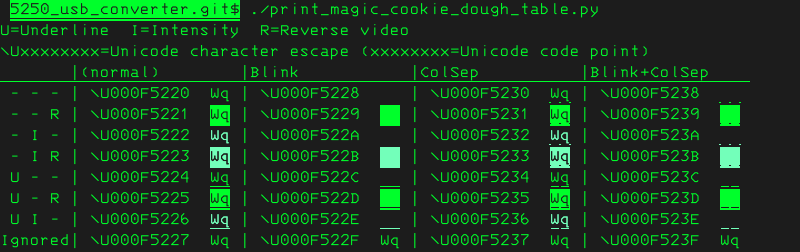

# Attribute handling in 5250-series terminals

## Attribute storage schemes

5250-series terminals support two different methods of applying attributes to the text displayed on the screen.  The following table provides a summary of the subsets of the terminals that support these schemes, how well the schemes align with the expectations of modern GNU/Linux libraries and programs, and the extent of support for these schemes in this project.  The remainder of this document provides additional details.

| Method                    | Terminal support | Modern compatibility | Support in this project |
| ------------------------- | ---------------- | -------------------- | ----------------------- |
| Attribute bytes           | all 5250-series  | low                  | "magic cookie dough"    |
| Extended Character Buffer | very limited     | potentially high     | none                    |


## Available attributes

These attributes appear to be available on all terminals:
* "reverse image"/reverse video
* "high intensity"
* "underscore"/underline
* "no display"/invisible
* blink
* "column separators": on older terminals this results in vertical lines appearing between character cells; in newer ones it causes a dotted underline to appear, or a dashed underline if the underline attribute is also enabled

Some 5250-series terminals also support color.

When using attribute bytes, only certain combinations of the above are available as there are only 32 attribute byte values (`0x20` through `0x3F`).  [5250 Information Display System to System/36, System/38, and Application System/400 System Units __Product Attachment Information__ (October 1989) page 28-29](https://bitsavers.org/pdf/ibm/5250_5251/5250_Information_Display_System_to_S36_S38_AS400_System_Units_Product_Attachment_Information_198910.pdf#page=46) describes the base attribute byte values for a monochrome terminal.  The same document describes how the same attribute byte values control colors.

Extended Character Buffers allow all combinations of the above attributes and colors to be used rather than the subset of combinations allowed with attribute bytes, and also provide additional attributes "word underscore", "half index up" and "half index down".  They also provide other more significant benefits described below.


## Attribute bytes

Attribute bytes are supported by all 5250-series terminals.

These bytes are vastly different from ANSI/VT100 escape sequences, which have been the de facto standard for many decades:
* The attribute byte consumes a character cell on the display.  Normally the cell corresponding to the attribute byte is blank without any attributes, but some terminals have a special mode where the hex value of the attribute byte is shown in the cell.
* Attributes are applied to the character cells between adjacent pairs of attribute bytes (but not to the attribute bytes themselves).  Attributes are also applied between the last attribute byte and the end of the screen.  In some very early 5251 terminals, the attributes from the last attribute byte wrap back around to the start of the screen, up to the first attribute byte.
* As a result of the above, writing a single attribute byte to the display generally immediately changes attributes of existing characters on the display.
* Each attribute byte sets the state of every attribute.  For example, to apply intensity and underline, rather than clear all existing attributes, then turn on intensity, and finally turn on underline - as would be done with a VT100 terminal - a single byte specifies that the current set of attributes is intensity and underline, with all other attributes off.

For example, imagine a program had displayed the following on the screen, with `█` representing the position of the cursor:

```
Enter your name: █___________________
[OK] [Cancel]
Press the Tab key to move between controls
```

Let us consider how the program would highlight the `[OK]` control in reverse video if the tab key was pressed.

With ANSI/VT100 escape sequences, the program might:
1. First change the current attribute to reverse video.  This has no immediate effect on the screen.
2. Move the cursor to the start of the `[OK]` control.  After this, the only thing that has changed on the screen is the position of the cursor.
3. Output `[OK]` again, replacing the existing plain text with reverse video text.

With 5250 attribute bytes, the `[OK]` and `[Cancel]` controls would have already been surrounded by a pair of attribute bytes applying normal attributes, represented here by `•` bullet symbols, but rendered as blanks on the screen:

```
Enter your name: █___________________
•[OK]•[Cancel]•
Press the Tab key to move between controls
```

The program would then highlight `[OK]` by overwriting the first attribute byte with one that sets reverse video.  To then move the highlight to `[Cancel]`, it would overwrite the first attribute byte again with the normal attribute and overwrite the second with one that sets reverse video.


### Magic cookies and their support in GNU/Linux

When the 5251 was introduced, having attribute bytes consume character cells wasn't uncommon, as it enabled the hardware to store only one byte per character cell, reducing memory requirements.

This was referred to in the Unix world as using _magic cookies_.  Such terminals could be referred to as _magic cookie terminals_, and the consumption of a character cell would be referred to as a _magic cookie glitch_ or _turd_ (see [The Jargon File](http://catb.org/jargon/html/M/magic-cookie.html)).

[The "Standout and Appearance Modes" section of the __GNU Termcap Manual__, Second Edition (December 1992)](https://www.gnu.org/software/termutils/manual/termcap-1.3/html_node/termcap_33.html) and [the __terminfo(5) man page__](https://man7.org/linux/man-pages/man5/terminfo.5.html) describe the sorts of behaviors typically expected from such terminals and how they may be expressed in the termcap and terminfo databases, which are used by libraries and programs to determine how to control a terminal.  It is not entirely clear how compatible these are with 5250-series terminals given that for example a single 5250 attribute byte can update multiple attributes, but termcap doesn't appear to have a way to specify this.

More importantly, many libraries and programs only ever had limited support for magic cookies given the complexity of managing them - when many terminals allow attributes to be changed at arbitrary points in the flow of text, terminals which interrupt the flow of text with a blank are the problem case - and this support has all but disappeared.

For example:

__ncurses__ - a popular library for interfacing to terminals - has lacked support for them since version 5.6 (released in 2006) or earlier: this was added to [its `TO-DO` file](https://github.com/mirror/ncurses/blob/master/TO-DO) in that release:
```
+ Magic cookie support (for nonzero xmc values) does not work, since the logic
  does not take into account refresh.  Also, the initial optimize does not
  adjust the current location when a cookie is emitted.
```

__GNU Emacs__ version 22 (released in 2007) included this in its `NEWS.22` file:
```
*** Support for `magic cookie' standout modes has been removed.

Emacs still works on terminals that require magic cookies in order to
use standout mode, but they can no longer display mode-lines in
inverse-video.
```


### Magic cookie dough

The mechanism that `5250_terminal.py` currently provides to enable control of attributes is referred to as "magic cookie dough" because it is a form of magic cookie that is "raw": it isn't known to termcap/terminfo or handled by ncurses, but is instead output directly by the program.

`5250_terminal.py` accepts certain UTF-8, non-ASCII character sequences representing Unicode characters - as detailed below - from the child Linux process and translates these into the attribute bytes supported by the 5250-series terminal.

Programs that allow configuration of certain parts of their output can then be configured to use these magic cookie dough characters at appropriate times.  For example, the Bash shell allows its normal prompt to be set via the `PS1` environment variable, and allows Unicode characters to be included in the value, so it can be easily configured to use magic cookie dough.

Ideally the program will be configured in such a way that it considers the magic cookie dough characters to be regular characters that will appear on the screen, so it knows they will consume a character cell.  For example, when configuring Bash's `PS1`, do *not* surround the magic cookie dough with a `\[` and `\]` pair to indicate it's a non-printing sequence, because then Bash (or the readline library it uses) will be unaware that the magic cookie dough has consumed a character cell, and screen corruption will occur for example when moving back through command history to long command lines - the commands will be placed further left than they should.

Where programs support it, it is suggested that magic cookie dough be specified in terms of character escapes rather than literal Unicode characters so that viewing the configuration file or form doesn't trigger the attributes.  For example, in Bash `attr_normal=$'\U000F5220'` will define an `$attr_normal` variable that will expand to the magic cookie dough for a normal attribute byte.

#### Characters and code points

`print_magic_cookie_dough_table.py` may be used to display a table showing the Unicode code points of the magic cookie dough characters and sample text with the attribute applied.  Here its output is displayed in a (yet-to-be-released) emulator, which is emulating a 3476 terminal attached to the USB converter:



If viewed outside of `5250_terminal.py`, the magic cookie dough characters just appear as characters from the [Unicode "Supplementary Private Use Area-A" block](https://en.wikipedia.org/wiki/Private_Use_Areas), which often means as a box containing hex digits that is twice the width of an ASCII character, as seen below:

```ShellSession
$ ./print_magic_cookie_dough_table.py
U=Underline  I=Intensity  R=Reverse video
\Uxxxxxxxx=Unicode character escape (xxxxxxxx=Unicode code point)              󵈤
       |(normal)    󰃰  󰃰|Blink       󰃰  󰃰|ColSep      󰃰  󰃰|Blink+ColSep󰃰  󰃰󵈠
 - - - | \U000F5220 󵈠Wq󵈠| \U000F5228 󵈨Wq󵈠| \U000F5230 󵈰Wq󵈠| \U000F5238 󵈸Wq󵈠
 - - R | \U000F5221 󵈡Wq󵈠| \U000F5229 󵈩Wq󵈠| \U000F5231 󵈱Wq󵈠| \U000F5239 󵈹Wq󵈠
 - I - | \U000F5222 󵈢Wq󵈠| \U000F522A 󵈪Wq󵈠| \U000F5232 󵈲Wq󵈠| \U000F523A 󵈺Wq󵈠
 - I R | \U000F5223 󵈣Wq󵈠| \U000F522B 󵈫Wq󵈠| \U000F5233 󵈳Wq󵈠| \U000F523B 󵈻Wq󵈠
 U - - | \U000F5224 󵈤Wq󵈠| \U000F522C 󵈬Wq󵈠| \U000F5234 󵈴Wq󵈠| \U000F523C 󵈼Wq󵈠
 U - R | \U000F5225 󵈥Wq󵈠| \U000F522D 󵈭Wq󵈠| \U000F5235 󵈵Wq󵈠| \U000F523D 󵈽Wq󵈠
 U I - | \U000F5226 󵈦Wq󵈠| \U000F522E 󵈮Wq󵈠| \U000F5236 󵈶Wq󵈠| \U000F523E 󵈾Wq󵈠
Ignored| \U000F5227 󵈧Wq󵈠| \U000F522F 󵈯Wq󵈠| \U000F5237 󵈷Wq󵈠| \U000F523F 󵈿Wq󵈠
```

Magic cookie dough does not allow the use of the "no display"/invisible attribute, as this would seem to be a security vulnerability: text could for example be included in an executable script, but not be visible when the script is opened in a text editor in `5250_terminal.py`.  The corresponding characters are shown as "Ignored" in the tables above: those characters are not treated as magic cookie dough characters, but are instead treated like any other Unicode character.


#### Drawbacks

An obvious drawback of the magic cookie dough approach is that instead of integrating with the built-in support for attributes in existing programs, programs must be configured one by one, one part at a time.  This approach is however more flexible than some more automated approaches that have been considered (see "Complex heuristics" below).

A less obvious drawback is that when output from one program is included in another, if the inner program uses magic cookie dough and the outer program allows truncation of its output, the outer program should use magic cookie dough too, otherwise attributes are likely to leak from the inner program to the outer program.

Example 1: GNU screen is running with a horizontal region split and Bash is running in the top region.  Bash's prompt includes the current path and has the reverse attribute applied to it.  The current path is long enough to cause the prompt to be split across two lines.  screen's scrollback feature is used, and the last line shown in the region is the first line of a prompt, which includes the reverse attribute byte.  In this case, because the normal attribute byte at the end of the prompt isn't visible, with a default screen configuration, the reverse attribute will be applied to the caption at the bottom of the region and the entire bottom region.  The solution here is to configure screen's `caption string` with magic cookie attributes, which is useful to highlight the caption anyway.

Example 2: `ls` has been configured using `dircolors` to use magic cookie dough so that executable files have the intensity attribute.  `ls -al | less -R` is run to allow paging through a lengthy directory listing.  An executable file in the directory has a long name, causing wrapping onto a second line.  The start of the file name appears at the bottom of the screen, just above the `less` prompt.  In this case, because the normal attribute byte at the end of the file name isn't visible yet, the intensity attribute is applied to the `less` prompt line.  The solution here is to configure `less` to use magic cookie dough in its prompts, which is useful anyway to highlight them.

Example 3: As for example 2, but using `more` instead of `less`.  `more` doesn't allow configuration of its prompts.  One solution here is to recompile it to change the prompt, but this causes ongoing maintenance issues.  An alternate solution would be to use `less` in its place, perhaps creating a shell alias which invokes `less` whenever `more` is specified in a pipeline.

Another issue is that the characters used for magic cookie dough could potentially occur in unexpected places.  The chosen characters are specified for "private use", so they are unlikely to be used in many contexts.  As an example, one known overlap is with a specialized, non-free font used for math.  In the unlikely case where a document intended to be viewed with those fonts is opened in a text editor in `5250_terminal.py`, or a web page which relies on the user having installed those fonts is opened in a web browser in `5250_terminal.py`, the characters which are intended to be displayed as mathematical symbols will instead result in attribute changes.  It seems quite unlikely that these issues would occur in practice, though.


### Other ways to utilise attributes

This section discusses a range of other methods that could enable better use of attributes.


#### Older GNU/Linux distribution

Try to find an old distribution containing packages that supported magic cookies.  It may be useful to make fake termcap and/or terminfo entries that extend VT52, using printable characters as magic cookies, and see whether those characters appear in the correct places without being inadvertently erased.


#### Complex heuristics

Emulate a VT100/ANSI terminal in `5250_terminal.py` (using e.g. [pyte](https://github.com/selectel/pyte)), keeping attribute information in memory, and using heuristics to determine which attributes to actually send to the 5250-series terminal.

One option would be to emulate a VT100 terminal with only 79 columns, reserving column 1 of the 5250's screen for attribute bytes, and apply whatever attribute is applied to column 1 in the emulated terminal to the entire 5250 screen row.  This would take care of highlighting status lines in software like screen and Emacs, and added/removed lines in diffs/patches.  It would be very confusing for text selections that span multiple lines but don't start or end on line boundaries, though.  Alternatively, perhaps determine which attribute is applied to the majority of the characters on a line.

Another option would be to allow attributes to be changed at any position along a row so long as they are adjacent to a blank character that can be replaced with the attribute byte.  This could be quite confusing in a syntax-highlighting editor where spaces may not always appear between adjacent spans of text with different attributes, but may work well in a web browser where the content of a page doesn't change and attributes are likely to be generally applied at a word level.


### Other issues with attribute bytes/magic cookies

Aside from the general lack of support for them in GNU/Linux and the cases already described where character cells must be reserved for them, consider that in a syntax highlighting programmer's editor, in the following line of code:

```
int main(void) {
```

`main` and `void` would generally be highlighted using different attributes, but while there's a space before `main` that could be replaced with an attribute byte without affecting the locations of characters on the string, additional blanks would appear at the end of `main` and around `void` due to the added attribute bytes, e.g.:

```
int main ( void ) {
```

Consider also the problem of highlighting selected text in an editor: as the selection is extended, there must always be a blank at the end of the selection, even if it's part-way through a word.

As a result of these issues, it would appear that in many of the situations where attributes are normally used by GNU/Linux programs, they cannot be used with magic cookie terminals.

Another annoyance is that when text with attribute bytes starts being output near the top of an otherwise-empty screen, each time an attribute byte enables attributes and a corresponding normal attribute byte has not yet been output, the entire remainder of the screen has the attributes temporarily applied to it, causing some flashing effects.  It may be desirable to find a way to configure shells to position the prompt at the bottom of the screen after clearing the screen - instead of at the top like normal - to avoid this in some cases.


## Extended Character Buffer (ECB)

This feature provides access to more than one byte of storage per displayed character cell, so attributes may be applied without consuming character cells.  As a result, VT100 color/attribute escape sequence behavior could probably be accurately emulated using ECBs, enabling a far more seamless integration with modern GNU/Linux.  This method appears to have been used by [oec](https://github.com/lowobservable/oec) to deal with a similar issue with 3270-series terminals.

However, in the 5250 series, this feature is only supported by the 3477 terminal and some or all 348x terminals.  As very few of those terminals are used with the 5250 USB converter, `5250_terminal.py` does not yet have any support for this feature.
